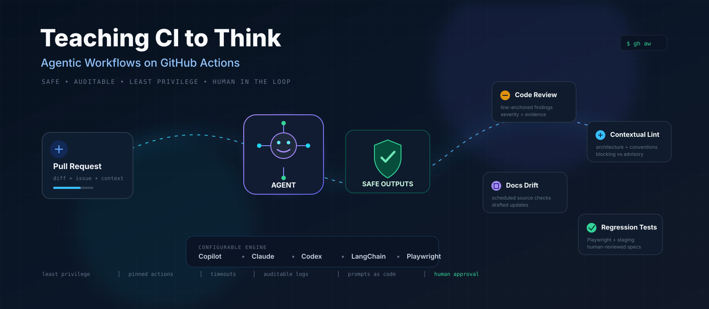
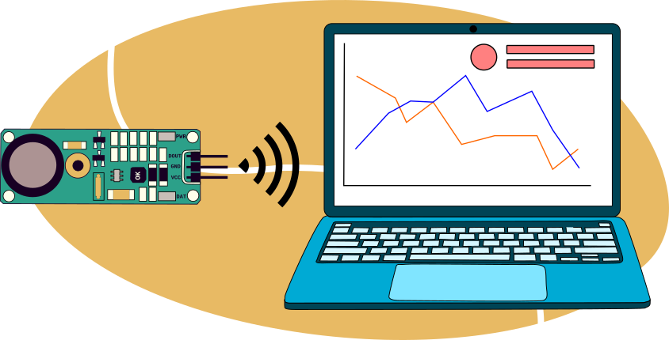

## 📋 Professional Summary

Full-stack developer with **4+ years** building enterprise-scale applications and AI-powered workflows. Specialized in **Next.js, Express.js, SpringBoot**, and **AI integration** for identity data analytics. Proven track record of scaling systems from **100K to 400K records/batch** and driving **90% reduction** in processing time across 18M+ record datasets.

## 💼 Work Experience

### Deloitte USI -- Gurugram

**Software Engineer 2 - DI App Factory**
June 2026 - Present

#### 📥 Ingestion Architecture

- Conducted architectural design study comparing DDX and Service Center data ingestion approaches, identifying that DDX's `S3 + MongoDB GridFS` architecture enabled faster and more scalable processing
- Enhanced data ingestion capabilities by developing configurable API integration for trusted data sources with custom mapping functionality to align client data points with internal schema attributes
- Implemented LDIF data ingestion for users, computers, and groups, with architectural redesign to handle group memberships more efficiently by creating a dedicated group membership collection with object references between groups, users, and applications
  - Designed and implemented schema attributes to establish relationships between SailPoint, Okta, and PingFederate data points and directory users, groups, and computers
- Led architectural decision-making process to balance system performance with compliance requirements, determining that optimizing existing MongoDB operations was more practical than S3 uploads due to AWS compliance overhead
  - Identified data upload bottleneck between EC2 instance and MongoDB server; relocated DB server to reduce network latency during import

#### ⚡ Performance Optimization

| Metric | Before | After | Impact |
|---|---|---|---|
| Batch Size | 100K records | 400K records | **500% increase** |
| Ingestion Rate | 10 rec/sec | 1,500 rec/sec | **150x faster** |
| Processing Time | Extended | 3-4 hours (18M records) | **90% reduction** |

- Improved bulk import performance through comprehensive performance profiling, new indexing strategies, batch size optimization, and bulk write operations instead of `findOneAndUpdate`

#### 🏛️ Platform & Governance

- Migrated DDX's data classification, definition and usecases feature into App Factory to identify orphan groups and inactive service accounts, making it cross-platform
- Extended the existing feature to track and alert on data ingestion errors, creating a quality gate check feature with custom business rulesets
- Created business application specific workflows to resolve shared groups, identify potential owners of orphan groups, and generate description for entitlements based on metadata

---

### Deloitte USI -- Gurugram

**Software Engineer 1 - DI App Factory**
Dec 2025 - June 2026

#### 🤖 GitHub Agentic Workflows

- Built AI-powered GitHub Agentic Workflows using `GitHub Actions`, markdown-defined workflows, `gh CLI`, and GitHub Copilot / Claude / Codex engines for autonomous pull request automation with secure guardrails
- Implemented Grumpy Code Reviewer using tools.github and LLM agents to review PRs, detect maintainability issues, and improve code review turnaround time
- Added intelligent lint-check workflows using bash tools, repository context tools, and PR triggers to validate coding standards
- Created automated jobs to generate PR descriptions from linked issues using contextual summarization agents
- Configured PR-triggered CI/CD pipelines so all review, documentation, testing, and quality workflows executed automatically on pull request creation

#### 📚 Documentation & QA Automation

- Built Continuous AI workflows to automatically update Confluence documentation using web-fetch/web-search tools and scheduled GitHub Actions pipelines
- Developed AI-assisted Playwright regression test generation workflows using playwright tools, issue context, PR metadata, and browser automation
- Built both high-code and low-code AI agents using LangChain, integrating prompt chains, tool-calling flows, and retrieval pipelines

---

### Deloitte USI -- Gurugram

**Associate Software Developer - DI App Factory**
July 2025 - Dec 2025

- Adapted to a new technology stack (`Next.js, ExpressJS, MongoDB, Redis`) and software development lifecycle, contributing to bug fixes, feature implementation, and peer code reviews
- Delivered on high-priority client requirements by enhancing UX through optimized data handling with MongoDB aggregation pipelines, identified and resolved critical performance bugs in API calls

---

### Deloitte USI -- Gurugram

**Associate Software Developer - DDPX**
Nov 2023 - July 2025

#### 🎯 Full-Stack Development

- Built visual graph-based analytics with React Flow and ChartJS to find security vulnerabilities in identity data
- Optimized dynamic data presentation in Next.js using dynamic routing, API payload tuning, and Bootstrap Table pagination; reduced data load time by **50%**

#### 🔐 Identity & Access Integrations

- Designed and implemented role based access control (RBAC) in Java for monolithic application, creating a whitelist of APIs and blocking all by default using multi-tenant handler in SpringBoot
- Set up SAML external Identity Provider like Okta, OAuth, AWS Cognito and Microsoft Azure Graph
- Researched offerings like Wiz and SkyArk to build a PoC integrating AWS IAM data using AWS SDK for Java
  - Developed diverse analytics use cases by correlating identity sources such as Active Directory, Microsoft Entra ID, and AWS IAM through MongoDB queries

#### 🧠 Analytics & Ownership Intelligence

| Capability | Result |
|---|---|
| Ownership Attribution Accuracy | **95%** (deterministic + Llama-powered probabilistic) |
| Records Analyzed | **100,000+** across multiple domains |
| Vulnerability Coverage | **80%** of data flagged |

- Created algorithms for ownership attribution in privileged entities using deterministic methods and Llama-powered probabilistic approaches
- Directed client engagements involving analysis of 100,000+ records across multiple domains, uncovering vulnerabilities

---

### Deloitte USI -- Gurugram

**Risk & Financial Advisory Analyst - DDPX**
June 2022 - Nov 2023

#### 🔬 Risk Analysis & AI Prototyping

- Developed an AI agent using machine learning (`Spacy 3, NLTK`) to identify potential owners of IAM principals based on description and info attributes
- Deloitte AI Academy Certified -- 8-week bootcamp covering Hadoop, PySpark, Tableau, GCP Vertex AI, NumPy, and Pandas

## 🚀 Projects

### Sensor Data Communication

**Open Source** | `MQTT` · `WebSockets` · `Django`

Real-time dashboard with **0.3ms downtime** to display remote sensor data using MQTT, WebSockets - Pub/Sub, and Django.

## 🛠️ Skills

| Category | Technologies |
|---|---|
| 🎨 Frontend/Backend | Next.js, ExpressJS, React Flow, ChartJS, Django |
| 💻 Languages/Tools | Java, Python, JavaScript, TypeScript, Git, Bash |
| 🗄️ Databases | MongoDB, Redis, MySQL |
| ☁️ Cloud/AI | AWS, GCP, Docker, Kubernetes, LangChain, Spacy 3, NLTK, Hadoop, PySpark, Tableau, NumPy, Pandas |
| 🏗️ Infrastructure | GitHub Actions, CI/CD, Microservices, Modular Monolith, Figma MCP |
